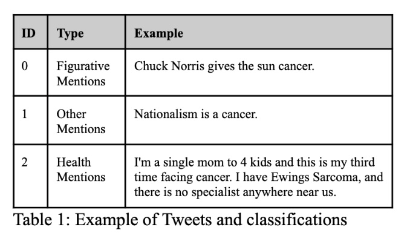

# Implementing BERT for Personal Health Mention Detection
### Claira Kauffmann, Akhila Ganti, Rachael Phillips

## Overview

This project, undertaken by Claira Kauffmann, Akhila Ganti, and Rachael Phillips at UC Berkeley, focuses on enhancing the detection of personal health mentions (PHM) in text, particularly from social media sources. With the increasing prevalence of health-related information on social media, accurately identifying personal health mentions has become crucial. The project aims to improve PHM detection by using advanced machine learning models, including BERT (Bidirectional Encoder Representations from Transformers), specifically the BioClinical BERT, to process social media data, particularly from Twitter.

## Technical and Structural Aspects

The project began by establishing a baseline using Convolutional Neural Networks (CNNs) integrated with GloVe embeddings for word representation. These models, while effective in some respects, showed limitations, especially in handling complex textual scenarios in social media data. To overcome these limitations, we integrated Long Short-Term Memory (LSTM) networks and spaCy for better capturing the contextual subtleties of language. 

The core of the project involved utilizing various BERT models, including a basic BERT model, BioClinical BERT, and Clinical BERT, to improve classification accuracy. These models were chosen for their bidirectional context understanding and self-attention mechanisms, making them well-suited for complex language patterns.

## Methodology

1. **Baseline CNN Model**: Developed using TensorFlow and GloVe embeddings, this model served as a starting point for comparison with more advanced models.
2. **LSTM Integration**: To address the CNN limitations, LSTM networks were employed, focusing on the syntactic structure of the language.
3. **Utilizing BERT Models**: A series of BERT models were tested, including a basic BERT model and pre-trained models like BioClinical BERT and Clinical BERT, for improved accuracy.

## Results and Discussion

The project achieved significant improvements in PHM detection accuracy. The BioClinical BERT model, in particular, showed a substantial improvement of 49.46% in the F-1 score compared to the baseline model. This success underscores the effectiveness of using more sophisticated, context-aware models for processing health-related social media data.

## Conclusion

The study presents a significant step forward in the field of health informatics, showcasing the effectiveness of BERT models in accurately detecting personal health mentions in social media text. The project's main contribution lies in developing and testing a more straightforward approach to PHM detection while maintaining high accuracy.

